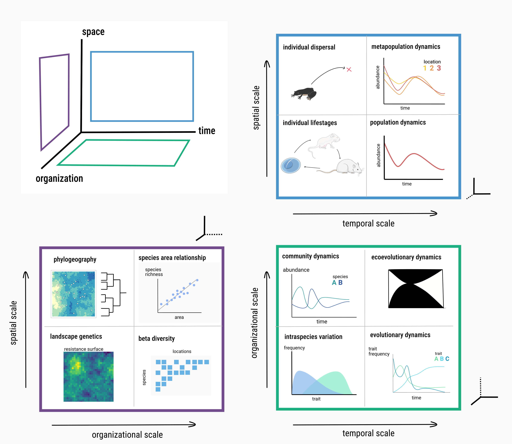
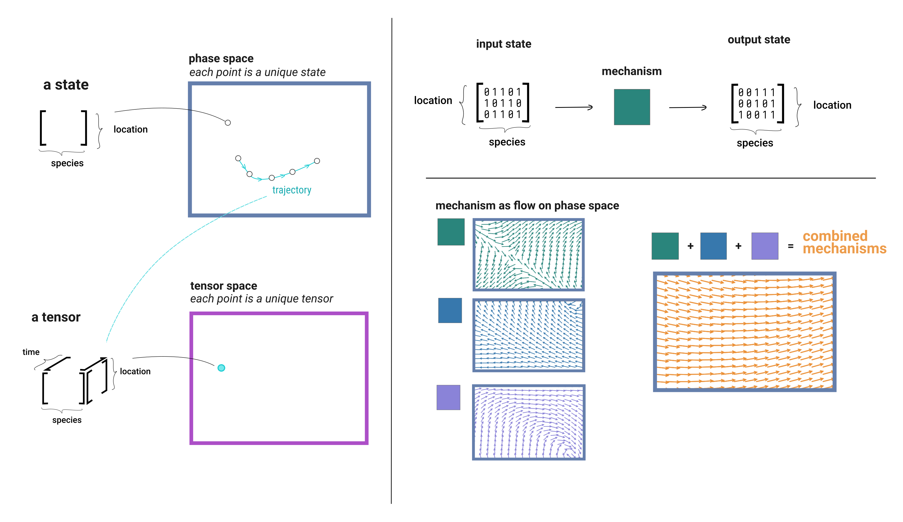
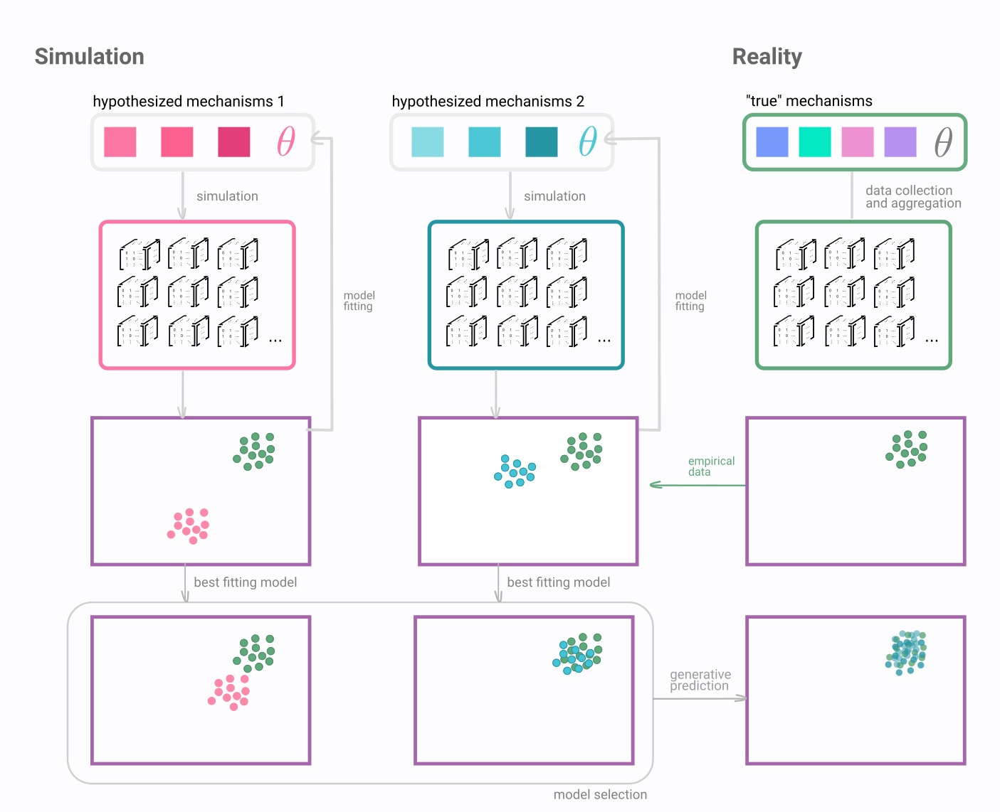

# Introduction

Ecosystems are quintessentially complex [@Levin1992ProPat]---they are
the emergent result of biological processes each of which exist on
a particular spatial, temporal, and organizational scale.
These processes influence and compound on one another to
produce the emergent diversity of functions and forms of life on Earth.
Understanding how human activity is changing Earth's ecosystems,
and how to best predict the ways ecosystems will change in the future,
remains a fundamental goal of ecology.

Still, predicting how ecosystems will change over time remains difficult.
How does one decide the best spatial, temporal, and organization scale at
which to model a processes such to best predict that process in the future?
There are innumerably many biological mechanisms that have been posited at any
given spatial/temporal/organizational scale. This results in the question: what
are the mechanisms best describe a set of data? Different levels of abstraction
have proven successful in predicting how biological systems change over time.

There is variation in the what scales are best for prediction
[@SDMPredictibility], and some forms of dynamics are intrinsically complex
enough to avoid effective prediction at all [@Pennekamp2019IntPre; @Beckage2011LimPre;
@Chen2019RevCom].

How do we predict how ecosystems will change at the scale of community ecology?
The mechanisms that influence the dynamics of communities are multifaceted.
@Vellend2010ConSyn proposes four fundamental mechanisms of community ecology:
speciation, selection, drift, and dispersal. The metacommunity concept
[@Leibold2003MetCom] provides a framework to understand how species interact,
how they are distributed across space, and how their changes through time. This
enables conceptual synthesis of evolutionary (trait drift and selection in
response to both the environment and other species) and ecological (species
interacting with oneanother and their environment) processes.
Many ecological and evolutionary processes fall within the metacommunity
construction. How does species respond to variation and change in the
environment? How does the composition of ecosystems (species) respond to
evolutionary processes, which form the species pool?

{#fig:slices}

Ecology is as much a study of emergent properties across scales as it is
anything to do with biology. The data we collect from these systems is
inherently noisy. This data contains information produced by a combination of
"true" mechanisms (interacting in unknown ways) combined with noise.

We first need to ask if we can understand the mechanisms producing these phenomena,
which we argue is synonymous with prediction.

The second question then becomes can we forecast/manage these systems?
Example of success in climate/weather forecasting.

# A dynamical systems perspective on metacommunity processes

***What is an ecological mechanism?***
A mapping between low dimensional
latent/parameter space and information space. Why is simulation necessary in
ecology? They allow us to produce data that encodes explicit mechanism
[@Crutchfield1992SemThe].

Dynamical systems is the subfield of mathematics relating to understanding how systems change over time.
often by applying a geometric perspective to state-space.

Within this abstraction, a metacommunity state is a set of measurements for
species across locations at a single point in time, which can be represented as
a matrix: a grid of measurements where each row corresponds to location and each column
to species.

Across timepoints, these states can be combined to formed trajectories
which can be represented as tensors

{#fig:flow}

# Using simulation to infer mechanisms in ecology

Science is fundamentally a theory of epistemology: a methodology and set of
principles to make justified claims about the world. Descriptive claims about
the world (the Earth goes around the sun, more species are found near the
equator than far from it) are considered justified if they make predictions that
agree with observed reality.
In order to determine if a descriptive claim agrees
with reality, it must be translated into a quantitative model that makes
predictions about things that can be measured. These quantitative models take
many forms. A subclass of these models, mechanistic models, represent latent
processes that can not be observed or measured, either inherently or due to
technological limitations.

> The electron is a theory we use; it is so useful in understanding the way
nature works that we can almost call it real.
>
> Richard P. Feynman

If one abandons the notion that a model represents some "truth" about the
world, against predictive accuracy. The problem is you cannot tell the
difference ---Huame and the induction problem.

{#fig:information}

If a simulation makes data the looks like real data, does it represent the
"true" world? Does it matter? Newtonian Gravity was "right", until GR was more
right. Different models at different levels of abstract provide varying levels
of predictive accuracy. Mechanisms that are incorrect that produce information
that shares statistical properties with empirical data can still be useful.

***What are the limitations of the utility of mechanistic simulations***
There are limits to the scope of simulation models. How do we know when they
are appropriate, versus a ML/non-mechanistic model?

***Need for flexible set of tools to do this*** setting up the next chapter

# References
